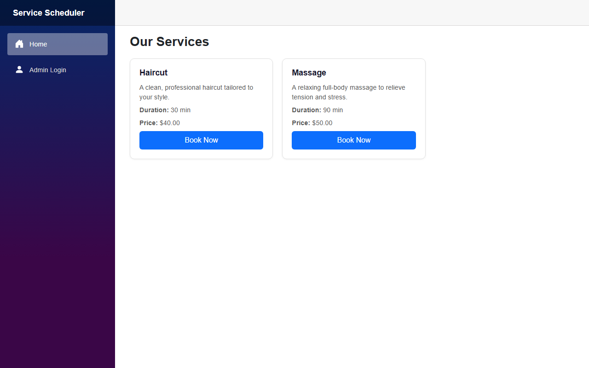
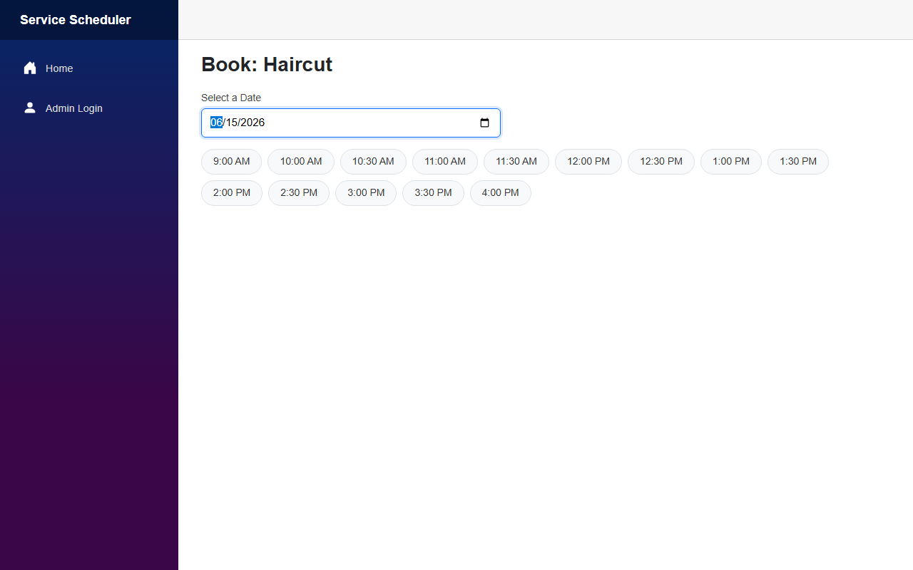
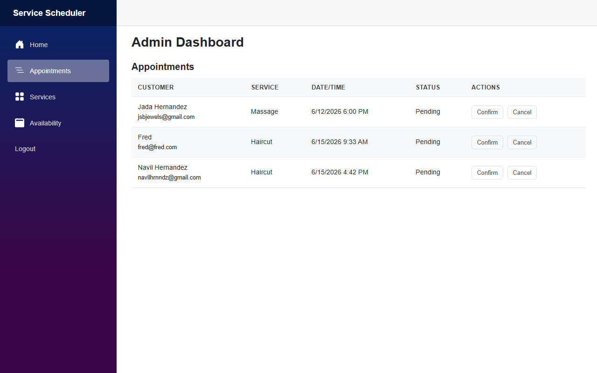
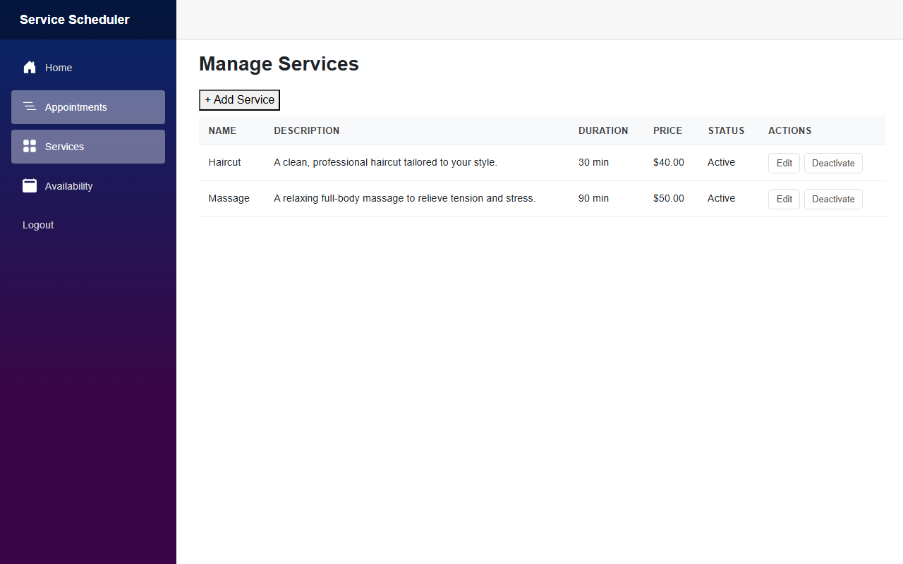
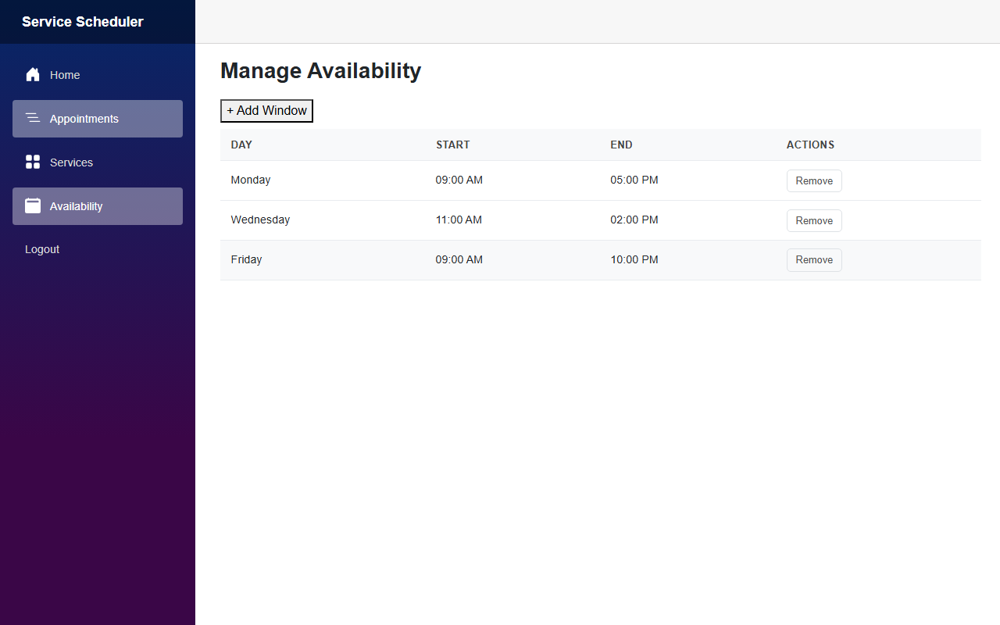

# Service Scheduler

A full-stack appointment booking application built with Blazor WebAssembly and ASP.NET Core, deployed to Azure. Customers can browse services and book appointments online; admins manage appointments, services, and availability through a protected dashboard.

**Live demo:** https://victorious-beach-06297ae1e.7.azurestaticapps.net

---

## Screenshots

### Customer — Browse & Book

| Services | Time Slot Selection |
|---|---|
|  |  |

### Admin Dashboard

| Appointments | Manage Services | Manage Availability |
|---|---|---|
|  |  |  |

---

## Tech Stack

| Layer | Technology |
|---|---|
| Frontend | Blazor WebAssembly (.NET 8) |
| Backend | ASP.NET Core 8 Web API |
| Database | Azure SQL Database (Entity Framework Core) |
| Auth | JWT Bearer tokens + BCrypt password hashing |
| Email | Azure Communication Services |
| Telemetry | Azure Application Insights |
| Hosting | Azure App Service (API) + Azure Static Web Apps (client) |
| CI/CD | GitHub Actions |

---

## Features

**Customer-facing**
- Browse active services with name, description, duration, and price
- Select a service and pick from available time slots for a given date
- Submit a booking and receive an email confirmation

**Admin (JWT-protected)**
- View all appointments in real time; confirm, cancel, or complete them
- Create, edit, and deactivate services
- Define weekly availability windows (day of week + start/end time)
- Email notifications sent to customers on status changes

---

## Architecture

```
┌─────────────────────────┐        ┌──────────────────────────────┐
│  Azure Static Web Apps  │        │      Azure App Service       │
│  Blazor WebAssembly     │──────▶ │  ASP.NET Core 8 REST API     │
│  (SPA, no server-side)  │  JWT   │  /api/auth                   │
└─────────────────────────┘        │  /api/appointments            │
                                   │  /api/services                │
                                   │  /api/availability            │
                                   │  /api/slots                   │
                                   └──────────┬───────────────────┘
                                              │
                          ┌───────────────────┼──────────────────┐
                          │                   │                  │
                   ┌──────▼──────┐   ┌────────▼───────┐  ┌──────▼──────────────┐
                   │  Azure SQL  │   │  App Insights  │  │  Azure Comm. Svcs.  │
                   │  Database   │   │  (telemetry)   │  │  (email)            │
                   └─────────────┘   └────────────────┘  └─────────────────────┘
```

---

## Running Locally

### Prerequisites
- [.NET 8 SDK](https://dotnet.microsoft.com/download)
- SQL Server (local or Azure)

### 1. Configure the API

Set the required environment variables (or add to `appsettings.Development.json`):

```
JWT_SECRET=<your-secret-key>
ConnectionStrings__DefaultConnection=<your-sql-connection-string>
AllowedOrigin=http://localhost:5196
```

### 2. Apply migrations

```bash
dotnet ef database update --project src/ServiceScheduler.Api
```

### 3. Start the API

```bash
dotnet run --project src/ServiceScheduler.Api --urls http://localhost:5080
```

### 4. Start the client

```bash
dotnet run --project src/ServiceScheduler.Client --urls http://localhost:5196
```

Open http://localhost:5196 in your browser.

---

## Running Tests

```bash
dotnet test
```

Integration tests use an in-memory database via `WebApplicationFactory` and cover appointment booking (including conflict detection) and role-based authorization on protected endpoints.

---

## Project Structure

```
service-scheduler/
├── src/
│   ├── ServiceScheduler.Api/        # ASP.NET Core REST API
│   │   ├── Controllers/             # Auth, Appointments, Services, Availability, Slots
│   │   ├── Data/                    # EF Core DbContext + migrations
│   │   └── Services/                # TokenService, EmailService
│   ├── ServiceScheduler.Client/     # Blazor WebAssembly SPA
│   │   ├── Pages/                   # Home, Book, Admin, AdminServices, AdminAvailability, Login
│   │   ├── Services/                # ApiService (HTTP client wrapper)
│   │   └── Auth/                    # JWT parse + Blazor AuthStateProvider
│   └── ServiceScheduler.Shared/     # DTOs and models shared by API and client
├── tests/
│   └── ServiceScheduler.Api.Tests/  # xUnit integration tests
└── .github/workflows/               # CI/CD — deploy API and client on push to master
```
